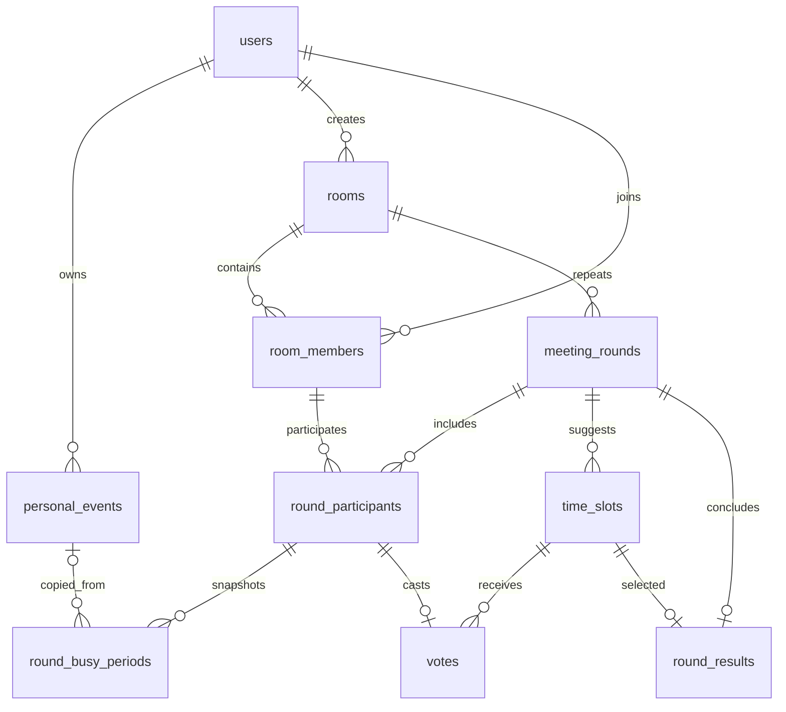
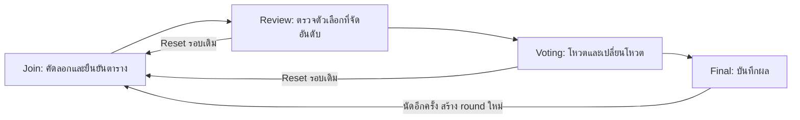

# โครงสร้างฐานข้อมูล Waongpa

ตารางธุรกิจ 9 ตาราง เชื่อมกับ users ของ Starter Kit รวมเป็น 10 ตารางหลัก ส่วน sessions, cache, jobs, password reset, 2FA/passkeys เป็น infrastructure ของ Laravel/Starter Kit ไม่ได้สร้างซ้ำในโมดูล

## อ่านความสัมพันธ์

- `||` = หนึ่งและต้องมี, `o{` = ศูนย์ถึงหลาย, `o|` หรือ `|o` = ศูนย์หรือหนึ่ง
- User กับ Room เป็น M:N ผ่าน room_members หนึ่งคนอยู่หลายห้อง ห้องหนึ่งมีหลายคน แต่มี owner_id เพียงคนเดียว
- Room กับ MeetingRound เป็น 1:N ทำให้นัดซ้ำกับสมาชิกเดิมได้โดยไม่เขียนทับประวัติ
- RoomMember กับ MeetingRound เป็น M:N ผ่าน round_participants เก็บบทบาทและน้ำหนักของรอบนั้น แก้สมาชิกปัจจุบันจึงไม่เปลี่ยนรอบที่จบแล้ว
- PersonalEvent คือข้อมูล Schedule ปัจจุบัน ส่วน RoundBusyPeriod คือสำเนาในรอบ source_event_id ยอมให้ว่าง เพื่อให้ลบต้นฉบับแล้วยังรักษาสำเนาได้
- Participant มี Vote ได้ 0 หรือ 1 รายการ การเปลี่ยนโหวตคือ UPDATE ไม่ใช่เพิ่มอีกแถว
- Round มี Result ได้ 0 หรือ 1 รายการ Result ชี้ TimeSlot ที่ชนะ ไม่คัดลอกเวลาเป็นข้อมูลซ้ำ

## Constraint ที่สำคัญ

1. unique(room_id, user_id) ป้องกันสมาชิกซ้ำในห้อง
2. unique(room_id, round_no) ป้องกันเลขรอบซ้ำ
3. unique(room_id, active_marker) โดย active_marker=1 สำหรับรอบยังไม่จบ และ NULL สำหรับรอบจบ SQLite อนุญาต NULL หลายค่า จึงมีรอบเก่าได้หลายรอบแต่รอบทำงานเพียงหนึ่งรอบ
4. unique(round_id, room_member_id), unique(participant_id ใน votes), unique(round_id ใน results)
5. Foreign key ไม่ได้ยืนยันโดยลำพังว่า Vote/Result และ TimeSlot เป็นรอบเดียวกัน Workflow ตรวจการอ้างข้ามรอบก่อนเขียน ต้องผ่าน service เมื่อเพิ่มช่องทาง API ใหม่
6. ค่า enum, น้ำหนัก, ลำดับเวลา และระยะนัดตรวจด้วย validation ฝั่ง service; migration นี้ยังไม่มี CHECK constraint สำหรับทุกกติกา

## วงจรรอบนัด

การ Reset ลบ time_slots และ votes ของรอบเดิม จึงเป็นการเริ่มกระบวนการใหม่จริง ต้องให้ผู้ใช้ยืนยันในหน้าจอ ส่วนรอบ Final จะไม่เปิดให้ Reset ใช้สร้างรอบใหม่แทน
